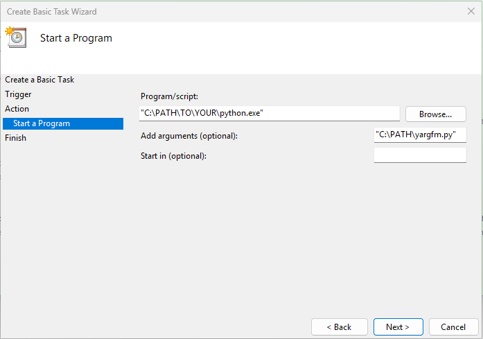

# YARGfm
Script to scrobble [YARG](https://yarg.in/) songs to [Last.FM](https://www.last.fm/). 
 
**Generative AI acknowledgment: This script was written with the Google Gemini 1.5 LLM. I do not claim to be the "programmer" of this script because I did not directly write the code. I simply revised it and researched the required mechanisms and processes that were converted into Python code.**

## Dependencies
YARG.fm requires the following Python libraries:
* [pytz](https://pypi.org/project/pytz/) (library for timecode conversions
* [pylast](https://github.com/pylast/pylast) (Python API wrapper for Last.FM)

It is **strongly recommended** that you have a basic understanding of Python and managing a Python environment before using this script.
## Usage
To set up YARG.fm, you must have a Last.FM API account. This is a straightforward process and can be done here: https://www.last.fm/api/account/create. API Applications can be viewed at https://www.last.fm/api/accounts.

After obtaining your API Key and Shared Secret, modify the configuration lines in `yargfm.py`. For privacy reasons, you may not want to hard-code these values into your `yargfm.py` instance.

| Value                 | Description                                                                                                                                                                            |
|-----------------------|----------------------------------------------------------------------------------------------------------------------------------------------------------------------------------------|
| `API_KEY`             | Your API key                                                                                                                                                                           |
| `API_Secret`          | Your API Shared Secret                                                                                                                                                                 |
| `USERNAME`            | Your Last.FM username                                                                                                                                                                  |
| `PASSWORD_HASH`       | Obfuscated value of your Last.FM password. Password should be inserted as`pylast.md5("YOUR_LAST_FM_PASSWORD")`                                                                         |
| `DB_PATH`             | The location of your `scores.db` file, located inside your YARG installation. A typical install path may be `"C:\Users\USER_NAME\AppData\LocalLow\YARC\YARG\release\scores\scores.db"` |
| `POLLING_INTERVAL`    | Length in seconds to wait between calls to YARG SQLite database (`scores.db`). Shouldn't need to be lower than once every 60 seconds.                                                  |
| `LAST_SCROBBLED_FILE` | Location of `last_scrobbled.txt`, a persistent file that holds the timestamp of the last scrobble. Should be safely placed *outside* of the YARG directory.                            |

After running the script for the first time, you'll be asked to authenticate the application. After this, all subsequent executions of the script should run on its own!

To automate `YARGfm` on Windows, you can use a tool like Task Scheduler to run the script. An example task could look like this:

**Known Issues**:
* The script will continue to scrobble the last played track every `POLLING_INTERVAL`. This should be a minor fix, but is mostly inconsequential given that Last.FM identifies and ignores duplicate scrobbles.

***Happy scrobbling!***
